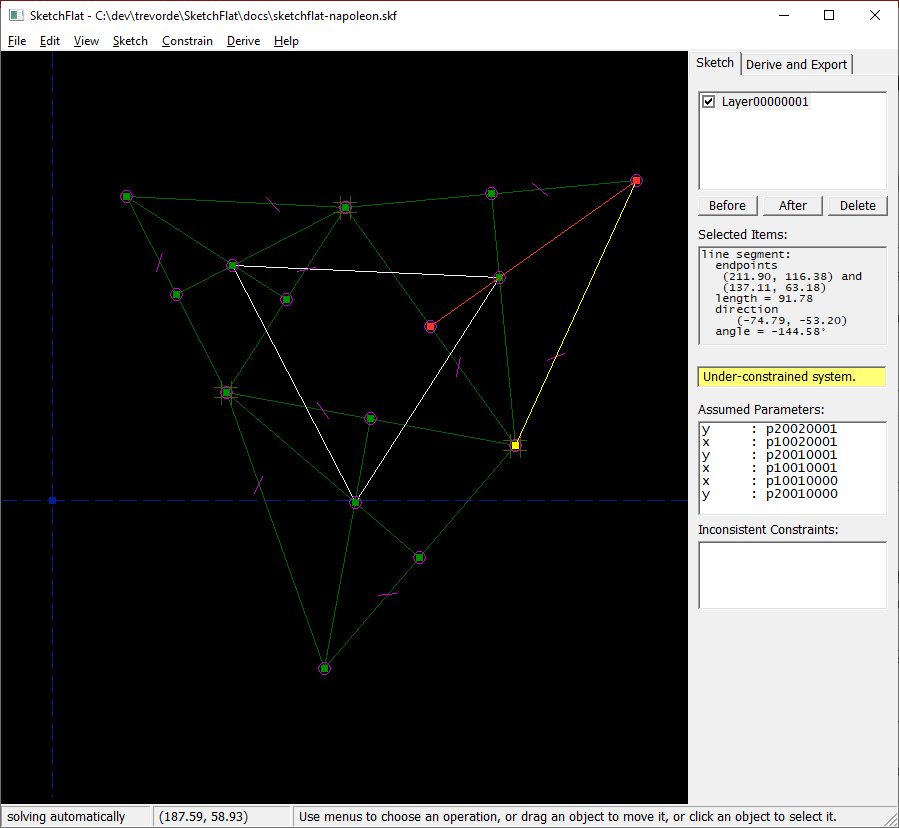

# SketchFlat
Parameterised sketches with geometric constraints!



## Background
This is a archive of [Sketchflat](https://cq.cx/sketchflat.pl) by Jonathan Westhues.
This has been superseded by [SolveSpace](https://en.wikipedia.org/wiki/SolveSpace).

## Prerequisites
* Windows
* Visual Studio 2022
  * desktop C++ workload

## Building
<details>

## Visual Studio project
In Visual Studio 2022, open:

`prj/SketchFlat.sln`

## Command line
SketchFlat is built using the Microsoft Visual C++ compiler. If that is
installed correctly, then you should be able to just run

    cd  sketchflat
    nmake

and see everything build.

</details>

## Internals
<details>

The sketch is represented by the data structure SK, which is declared
in sketch.cpp. This data structure contains the lists of entities and
constraints, as SK->entity[] and SK->constraint[]. When the user edits
the sketch, by adding or deleting entities or constraints, these lists
keep track.

When the sketch is solved, we generate a list of points, datum lines,
and solver parameters. (For example, a line segment generates two points,
for its endpoints, and those two points then generate two parameters
each, for the x and y coordinates. A circle generates a point, for its
center; that point generates two parameters, and the circle generates
an additional parameter for its radius.)

Once we have our list of parameters to solve for, we write the constraint
equations. These are symbolic equations, in terms of the parameters. The
symbolic algebra routines are in expr.cpp. The routines that go from
constraints to equations are in constraint.cpp. The finished equations
are stored in EQ->eqn[].

Then, the equations are checked for consistency. Each equation is
linearized about the current state of the sketch, and the solver
writes a Jacobian matrix. If the system is under-constrained, then
assumptions are made until it's exactly constrained. If the constraints
are inconsistent, then a warning is displayed to the user, and we stop.
All of this happens in assume.cpp.

The system of equations is then partitioned into smaller subsystems
that can be solved independently. This improves our speed; it's the
reason why SketchFlat can solve much bigger sketches than commercial
tools. This happens in solve.cpp. Each subsystem is solved numerically,
by a Newton's method, in newton.cpp.

Once the parameters are known, we can generate the curves in the sketch.
These are written as parametric equations (where the word `parametric'
has nothing to do with the solver parameters, of course), and stored in
SK->curve[].

Finally, the curves are broken down into piecewise linear segments. These
pwls are stored in SK->pwl[]. Both the display code and the file export
code work from this list.

Everything above describes the solver, and my representation of the
sketch. This is the core of SketchFlat, and the most difficult part.
Other modules (for the derived operations, file load/save, file
export, all the graphics stuff) contain many lines of code, but are
straightforward by comparison.

</details>

## Further work
<details>

Jonathan Westhues:

```text
To some extent, SketchFlat is `done'. I wrote this tool mostly for my
own use, and it now does most of what I want. My solver is faster than
any comparable solver that I've seen in a commercial tool. I can easily
solve sketches where Pro/E bogs down to the point that it's unusable.

I suspect that it wouldn't be hard to get another 5x speedup, but that
this would add a couple thousand lines of code. This would involve more
caching; right now, for example, the symbolic Jacobian is written and
then discarded every time we solve.

The numerical routines are crude. I'm never very smart about numerical
stability; but I'm using doubles, and I don't have to deal with much
dynamic range in my parameters, so I can get away with a lot. Most of
the tolerances (e.g. for convergence of the Newton's method) are set
empirically, or with very limited analysis. Tolerances are constant;
this means that bad things happen if the user draws a huge or tiny part.

The derived operations are an afterthought. They're slow, and fail
to handle many useful special cases. If anything needs enhancement,
it's those.
```

</details>

## Further information
<details>

* [SketchFlat](https://cq.cx/sketchflat.pl)
* [SolveSpace](https://en.wikipedia.org/wiki/SolveSpace)
* [geometric constraint solving](https://en.wikipedia.org/wiki/Geometric_constraint_solving)
* [SketchFlat2019](https://github.com/pentagrid/SketchFlat2019)
* [SketchFlat in javascript](https://github.com/tmpvar/sketchflat.js)
* [NoteCAD](https://github.com/NoteCAD/NoteCAD)
  * [web assembly demo](http://notecad.xyz/)
* [FreeCAD geometric constraint solver](https://github.com/FreeCAD/FreeCAD/tree/master/src/Mod/Sketcher/App/planegcs)
* [articles on geometric constraint solving](docs)

</details>
